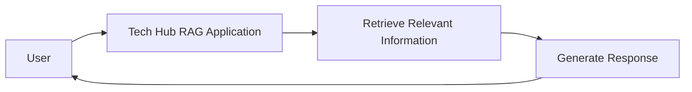

# Tech Hub RAG

Tech Hub RAG is a project for the NSC Tech Hub.

## Project Status

This project is currently under development.

## Project Structure

```text
Tech-Hub-RAG/
├── .github/
│   └── ISSUE_TEMPLATE/
│       └── feature_request.md
├── CONTRIBUTING.md
└── README.md
```

## Architecture Diagram

The following diagram shows the planned high-level workflow for the Tech Hub RAG project.



## Contributing

Please read [CONTRIBUTING.md](CONTRIBUTING.md) before contributing to this project.